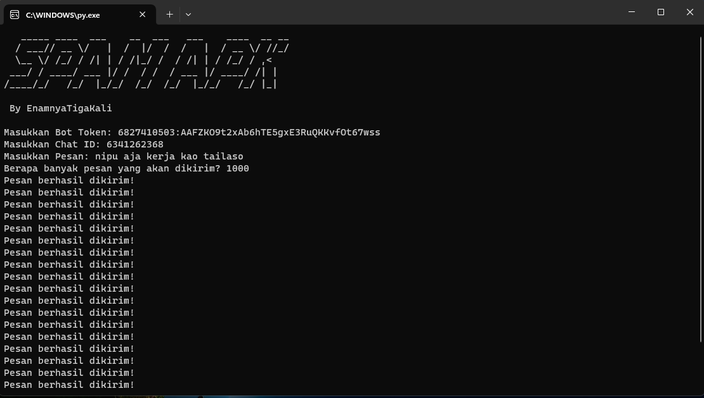

# Spam APK Tools
Ini adalah Tools Sederhana untuk melakukan Spam kepada Bot Penipuan APK yang marak saat ini.
Dengan Tools ini membantu pengguna untuk mengirimkan spam dengan mengonfigurasi ID Bot Token, Chat ID, pesan yang akan dikirim, dan jumlah pesan yang diinginkan.

# Cara Menggunakan
1. Clone Repository
2. jalankan script spamapk.py
3. Masukkan ID Bot Token dan Chat ID Target.
4. Masukkan pesan yang akan dikirim.
5. Tentukan jumlah pesan yang ingin dikirim.
6. Script akan mengirim pesan sesuai dengan input yang diberikan.

